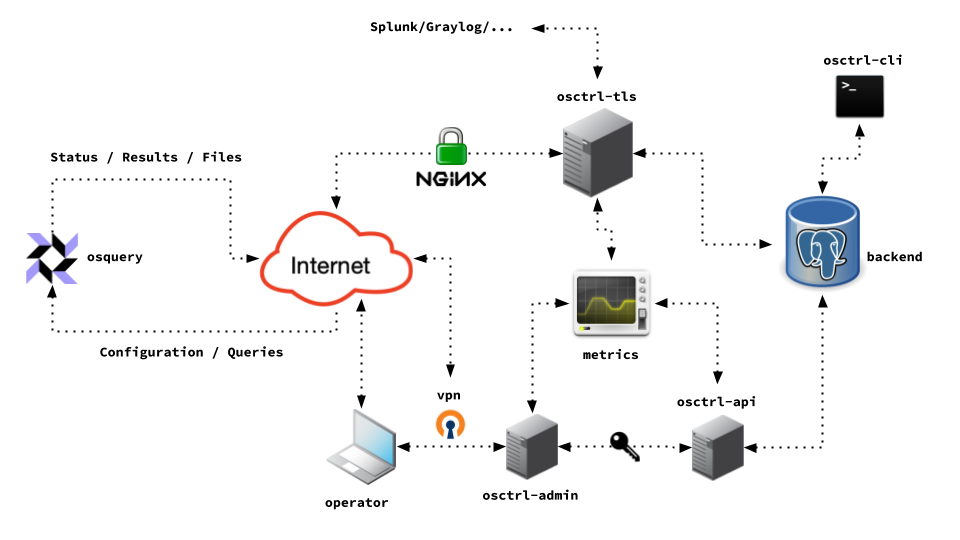
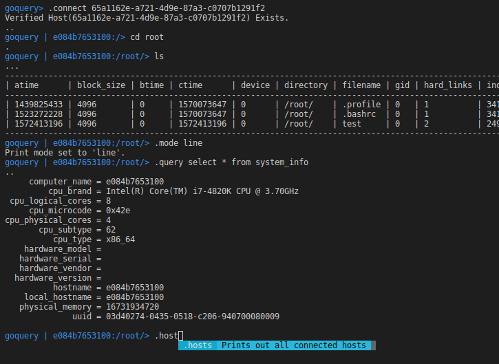

[osctrl](https://osctrl.net) was originally [released](/posts/introducing-osctrl/), as a performant TLS endpoint for [osquery](https://osquery.io), with an initial set of features, such as modular components or file carving.

In the last year, there have been [numerous releases](https://github.com/jmpsec/osctrl/releases), from `0.1.0` to `0.2.3`, implementing additional features, bug fixes and all in all aiming at making it more efficient, reliable and user friendly.

Some time ago, a new component, the `osctrl-api`, [was added](https://github.com/jmpsec/osctrl/pull/28) with the intention of enabling the integration of osctrl with other systems, therefore allowing engineering teams to expand its functionality, which is sometimes not even in the original scope of the project.

The initial implementation of `osctrl-api` followed the principles described in the great document written by [Wim Remes](https://twitter.com/wimremes) from WireSecurity: the [**API Maturity Model](https://github.com/wiresecurity/APIMaturity)**. The focus of this tool is not only for the attention of security professionals but also to be used by development teams to ensure they are developing their own APIs with security in mind.

The `osctrl-api` component was critical to enable integration with other tools such as [**goquery](https://github.com/AbGuthrie/goquery)**, which was built independently by its own creators, yet then able to utilize the data and capabilities of osctrl.

Very often security products do not realize the upside of offering flexible and powerful APIs. For instance, those empower security engineering teams to build tooling around their products. The perception goes from snake-oil-vendor as ‘I know nothing about how it works, but it works…sometimes’, to something that can be integrated with other solutions and systems.

Automation is one of the main objectives when building an api, which is not something that only Security engineering teams can benefit from. After all, operations teams can also utilize the visibility and monitoring that **osctrl** and [osquery](https://osquery.io) offers!

There is a lot of additional work left to be done for *osctrl-api*. More functionalities must be added and all in all, there is always room to improve its capabilities to enable even more integrations. And last but not least, documenting it all properly!

If you want more information about **osctrl**, visit [https://osctrl.net](https://osctrl.net) or [https://github.com/jmpsec/osctrl](https://github.com/jmpsec/osctrl)

Also find us in the *#osctrl* channel in the official [osquery Slack community](https://osquery.slack.com) ([Request an auto-invite!](https://join.slack.com/t/osquery/shared_invite/zt-h29zm0gk-s2DBtGUTW4CFel0f0IjTEw))
