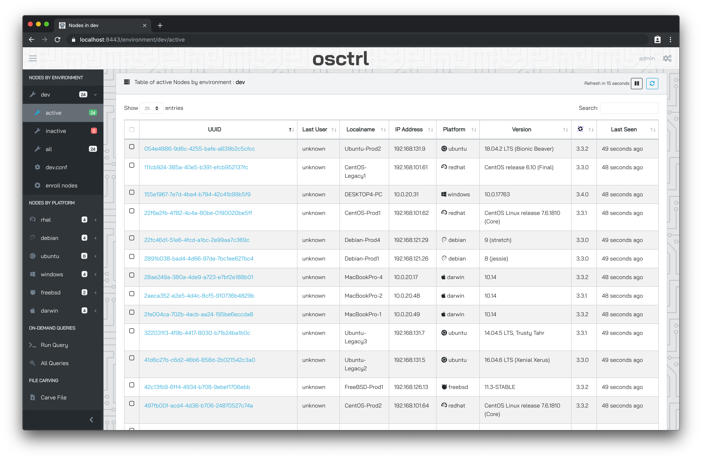
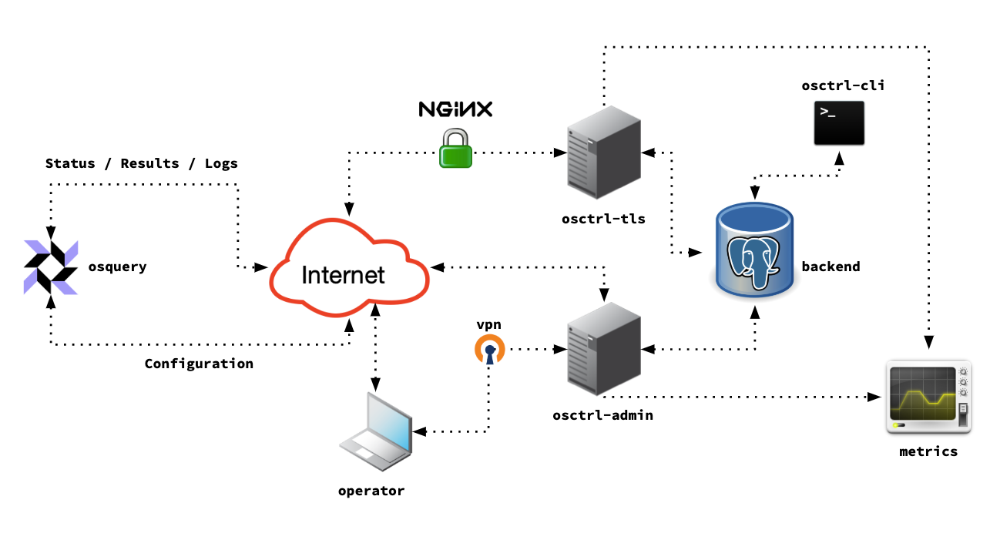
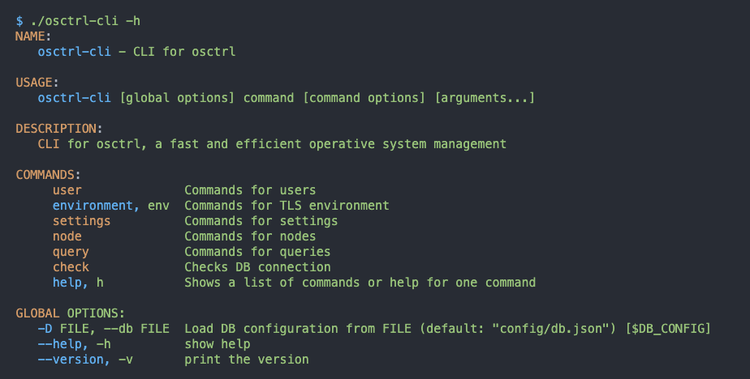

Introducing [osctrl](https://osctrl.net), a new solution to manage [osquery](https://osquery.io/) clients as TLS endpoint.

## What is osctrl?

[osctrl](https://osctrl.net) is a fast and efficient [osquery](https://osquery.io/) management solution, implementing its [remote API](https://osquery.readthedocs.io/en/stable/deployment/remote/) as TLS endpoint. It offers a scalable and reliable service that will help enhance your incident response and detection capabilities, by following a model where critical functions are split into different components.

## What can I do with osctrl?

* Monitor all your systems running [osquery](https://osquery.io/),

* Distribute [osquery](https://osquery.io/) configuration fast across all your enrolled nodes,

* Collect all the status and result logs, whether you want to store them or forward them to a different system ([Splunk](https://www.splunk.com), [ELK](https://www.elastic.co/what-is/elk-stack), [Kafka](https://kafka.apache.org/), [Graylog](https://www.graylog.org/)… ),

* Run quasi-real-time on-demand queries in your selected enrolled nodes,

* Carve files or directories from your enrolled nodes.

## Further Reading

* [osctrl code repository in Github](https://github.com/jmpsec/osctrl)

* [osctrl Documentation](https://www.osctrl.net/)

* [osquery main site](https://osquery.io/)

* [List of other open source solutions for osquery](https://www.uptycs.com/blog/deploying-osquery-at-scale-a-comprehensive-list-of-open-source-tools)

## Any questions?

If you have any questions about [osctrl](https://osctrl.net), feel free to create an [issue in Github](https://github.com/jmpsec/osctrl/issues) or reach out to me directly in Twitter ([@javutin](https://twitter.com/javutin)).

Also, there is the *#osctrl* channel in the [osquery official Slack](https://slack.osquery.io/).
