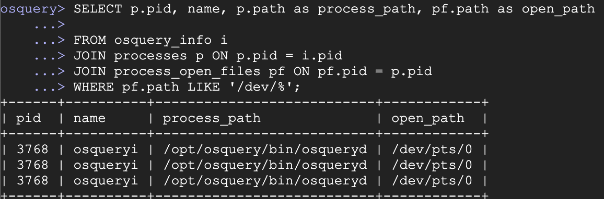
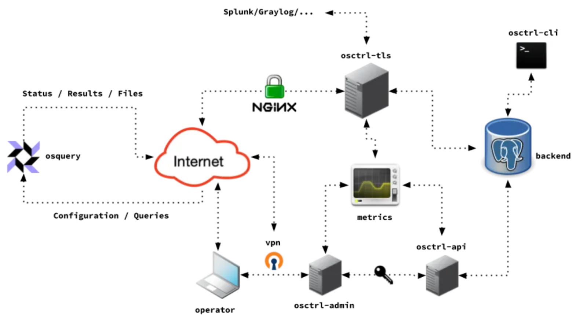
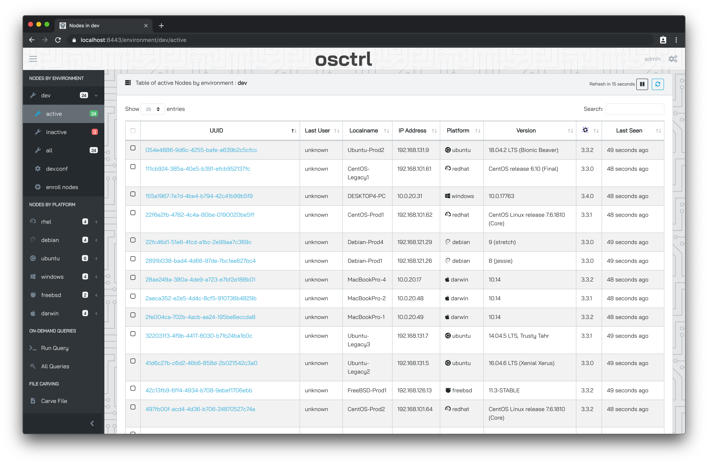

> Get ready to discover the power of [osquery](https://osquery.io) and [osctrl](https://osctrl.net), your dynamic duo for advanced system monitoring and security.

[osquery](https://osquery.io), the SQL-based open-source tool, lets you query your systems like a database, transforming complex system data into actionable insights. Paired with [osctrl](https://osctrl.net), a potent orchestration platform, you’ll gain real-time control and visibility over your network’s security posture.

This integrated toolkit empowers security engineers to protect their environments and rapidly address threats, spanning from incident detection to system optimization.

## What is osquery?

**osquery** is an open-source, cross-platform framework for querying and monitoring the state of your computer as if it was a relational database. It allows you to treat various aspects of your operating systems, such as file systems, running processes, hardware, network configurations, and more, as structured data that you can query using SQL-like queries.

Key features and characteristics of **osquery** include:

* **SQL-Based Interface**: This tool provides a familiar SQL-based query language for retrieving information about system and security-related attributes. This makes it accessible to a wide range of users, including system administrators, security analysts, and developers.

* **Cross-Platform Support**: Designed to work on various operating systems, including Linux, macOS, Windows, and more, it’s a versatile solution for monitoring and managing systems in heterogeneous environments.

* **Real-Time Monitoring**: Users can actively monitor the state of their systems in real time, enabling identification of security vulnerabilities, potential issues, and abnormal behavior as it happens.

* **Extensible and Customizable**: The platform is highly adaptable. Users can define their own tables and queries to gather specific information or track particular system attributes based on their requirements.

* **Security and Compliance**: Commonly used for security and compliance monitoring, this tool helps organizations track and audit various aspects of their systems to ensure adherence to security policies and best practices.

* **Performance Monitoring**: **osquery** allows querying of performance-related data, including information about CPU usage, memory, and disk activity. This can be useful for system optimization and troubleshooting.

* **Logging and Data Collection**: It can be configured to collect and log data for analysis and forensics, proving invaluable for incident response and investigating security breaches.

* **Integration with Security Tools**: Many security and monitoring tools can leverage this platform to gather valuable data for analysis and alerting, enhancing the capabilities of existing security infrastructure.

* **Community and Ecosystem**: An active open-source community and a growing ecosystem of extensions, plugins, and tools expand the functionality and utility of this system monitoring solution.

Overall, **osquery** is a powerful and flexible tool for system monitoring, security auditing, and compliance tracking. Its ability to convert system information into structured data that can be queried and analyzed with SQL makes it a valuable resource for system administrators, security professionals, and organizations aiming to maintain the integrity and security of their computer systems.

## osquery components

There are two core components in osquery and each serve unique roles, but they work in tandem to provide comprehensive insight and control over your networked systems.

### osqueryi

**osqueryi** is the interactive interface, where users can flex their query muscles. Think of it as the ‘brain’ of **osquery**, allowing security engineers and system administrators to ask real-time questions about the state of their systems using SQL-like queries. It’s your gateway to on-demand system information, providing an intuitive and user-friendly experience for ad-hoc inquiries, system analysis, and debugging.

### osqueryd

**osqueryd**, on the other hand, is the ‘watchful eye’ of the operation. This daemon component of osquery operates in the background, continuously collecting and monitoring data from your systems based on predefined queries and configurations. It acts as an agent, ensuring that you receive a constant stream of updated information on your systems’ performance and security, offering a powerful tool for real-time system monitoring, threat detection, and incident response.

Together, **osqueryi** and **osqueryd** form the heart and soul of **osquery**, empowering security engineers to seamlessly interact with, analyze, and secure their systems, whether on-demand or in a proactive, ongoing manner.

## Local vs distributed

There is a big difference between the two components in terms of configuration and log collection:

### osqueryi

* **Local configuration**: osqueryi is primarily designed for local, on-demand use. It allows you to execute ad-hoc queries and configuration settings directly from the command line or a local script. You can define and adjust queries and settings on the spot, making it suitable for immediate system analysis and troubleshooting without the need for persistent configuration files.

* **Local Log Collection**: When using osqueryi, the logs are typically viewed and analyzed locally on the system where the queries are run. The results are displayed directly to the user through the command line interface, making it ideal for one-off queries and quick insights into the system’s status. However, these logs are not easily collected and analyzed centrally, which limits their scalability for large-scale monitoring and incident response.

### osqueryd

* **Distributed Configuration**: osqueryd, in contrast, is designed for continuous, distributed monitoring and configuration. It can be configured to run predefined queries and settings in the background as a daemon, and the configuration can be distributed across multiple systems using a TLS (Transport Layer Security) component. This means that you can maintain a consistent configuration across numerous systems, making it well-suited for large-scale deployments.

* **Distributed Log Collection**: osqueryd is also capable of collecting logs and system data based on the distributed configuration. The logs and results are collected from multiple systems and can be sent to a centralized server or database for analysis. This distributed log collection approach enables organizations to have a centralized view of system status and security across their entire network, making it invaluable for real-time monitoring, threat detection, and incident response at scale.

In summary, **osqueryi** is more suitable for local, ad-hoc queries and quick system analysis, while **osqueryd** is designed for continuous, distributed monitoring with a centralized configuration and log collection system. The choice between them depends on your specific use case and whether you need on-demand local insights or continuous, centralized control and monitoring capabilities.

## Distributed deployment: [osctrl](https://osctrl.net)

[osctrl](https://osctrl.net) serves as the orchestrator and coordinator in a distributed deployment of osquery. This essential component provides centralized control and management of osquery agents running on various systems throughout a network.

The system’s architecture is built on modular and independent components, enhancing both its reliability and scalability:

* `osctrl-tls` : The secure communication gateway that manages connections and data transfer between osquery agents and the **osctrl** deployment.

* `osctrl-admin` : A web-based interface for administrators to manage osquery fleets, configure settings, and view collected data.

* `osctrl-api` : A RESTful API service that enables programmatic interaction with osctrl, allowing integration with other tools and automation of management tasks.

* `osctrl-cli` : A command-line interface tool for interacting with **osctrl**, providing quick access to common management and data retrieval functions.

This project streamlines the process of configuring, updating, and monitoring osquery agents, ensuring that they adhere to a consistent and up-to-date configuration. It acts as a bridge, allowing security professionals to efficiently distribute configurations, queries, and updates to numerous agents, and collect their logs and results in a centralized location for analysis.

By acting as the command center, **osctrl** simplifies large-scale system monitoring, enhances threat detection, and enables rapid incident response, making it a crucial component for organizations looking to maintain a secure and well-coordinated network of systems.

### Configuration management

**osctrl** provides robust capabilities for centralized configuration management in a distributed osquery deployment. It allows security administrators to define and maintain consistent [configurations](https://osquery.readthedocs.io/en/stable/deployment/configuration/) for osquery agents across multiple systems. This ensures that all agents adhere to the same security policies and settings, simplifying system administration and reducing the risk of configuration drift.

### Real time queries

Security teams are empowered with the ability to execute real-time queries across their network of osquery agents. This feature facilitates instant data retrieval and analysis, enabling security engineers to respond swiftly to emerging threats or investigate system anomalies. The orchestrator allows for the execution of ad-hoc queries on individual agents or entire groups of agents, providing invaluable visibility into the state of systems and helping to identify security issues as they arise.

### File carving

The file carving capabilities are instrumental in forensic analysis and incident response. It enables the extraction of specific files from remote systems in a distributed deployment, allowing investigators to retrieve potentially critical data from compromised or suspicious hosts. This feature can be crucial in cases where there’s a need to recover artifacts or evidence from across the network, aiding in post-incident investigations and threat hunting.

## Advanced use cases for osquery

### File Integrity Monitoring (FIM)

For sophisticated security needs, this tool stands out as an excellent File Integrity Monitoring (FIM) solution. Its real-time monitoring capabilities, paired with structured data output, make it ideal for tracking changes to critical files and directories. Security teams can craft custom queries to keep tabs on specific files or configurations, alerting them to any alterations. This approach helps organizations maintain system integrity, quickly identify unauthorized changes, and respond promptly to potential security incidents.

> [File Integrity Monitoring (FIM) - osquery wiki](https://osquery.readthedocs.io/en/stable/deployment/file-integrity-monitoring/)

## Extending the Agent

The extensibility of osquery’s is a powerful feature for advanced users. In this context, organizations can develop and integrate custom plugins into their agents to cater to unique monitoring and data collection requirements. These custom plugins enable osquery to collect data from proprietary applications, custom databases, internal systems, and specialized security sources. The result is a highly tailored monitoring solution that adapts to the organization’s specific needs. This versatility is particularly beneficial for those with diverse or non-standard technology stacks, as it ensures this tool remains an invaluable part of their security toolkit.

> [Using Extensions - osquery wiki](https://osquery.readthedocs.io/en/stable/deployment/extensions/)

## Advanced Auditing and Compliance

Integrating osquery with auditing frameworks, such as auditd on Linux systems, extends its capabilities into advanced auditing and compliance use cases. It can query, analyze, and report on audit logs, providing a centralized and structured view of system activity. This integration is essential for organizations subject to regulatory compliance requirements, as it streamlines auditing processes and simplifies compliance monitoring. The SQL-like querying allows for detailed analysis of audit logs, ensuring that organizations can demonstrate adherence to compliance standards during audits.

> [Process Auditing - osquery wiki](https://osquery.readthedocs.io/en/stable/deployment/process-auditing/)

In summary, osquery’s advanced use cases encompass file integrity monitoring for real-time security, extensibility through custom plugins for tailored data collection, and audit integration to streamline compliance and auditing processes. These capabilities make osquery a versatile and powerful tool for maintaining system integrity, adapting to diverse technology stacks, and ensuring regulatory compliance in complex IT environments.

## Conclusion

In today’s ever-changing world of cybersecurity threats, [osquery](https://osquery.io) and [osctrl](https://osctrl.net) offer a powerful and flexible solution. They do more than just bolster an organization’s security; they also simplify the management of their systems. This open-source partnership empowers security experts to be vigilant, agile, and maintain full command over their IT infrastructure, ultimately reinforcing the strength and safety of their entire network.

## References

* [https://osquery.io/](https://osquery.io/)

* [https://github.com/osquery/osquery](https://github.com/osquery/osquery)

* [https://engineering.fb.com/2014/10/29/security/introducing-osquery/](https://engineering.fb.com/2014/10/29/security/introducing-osquery/)

* [https://engineering.fb.com/2015/07/20/security/osquery-introducing-query-packs/](https://engineering.fb.com/2015/07/20/security/osquery-introducing-query-packs/)

* [https://osctrl.net](https://osctrl.net)

* [https://github.com/jmpsec/osctrl](https://github.com/jmpsec/osctrl)

* [https://javuto.medium.com/introducing-osctrl-91583e3fa75d](https://javuto.medium.com/introducing-osctrl-91583e3fa75d)

* [https://javuto.medium.com/introducing-osctrl-api-715d3ff38d07](https://javuto.medium.com/introducing-osctrl-api-715d3ff38d07)
